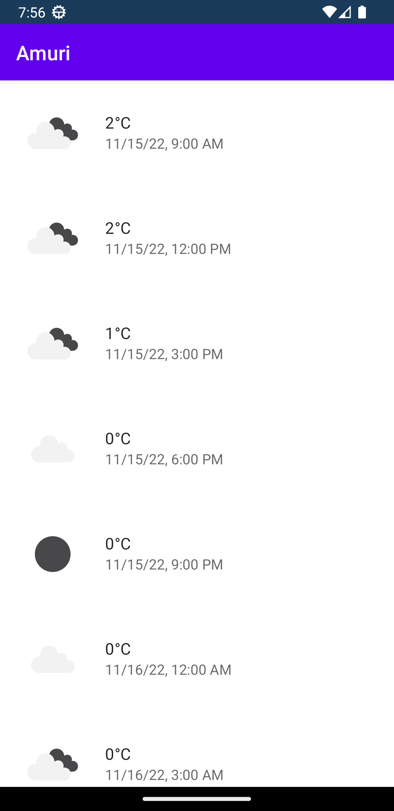

# WeatherApp

WeatherApp on Android-sääsovellus, joka hakee tulevan viiden vuorokauden sääennusteen laitteen GPS-sijainnin perusteella. Sovellus on kehitetty Tampereen työvalmennussäätiö Sykkeen IT-pajalla harjoitustyöksi, jolla tutustutaan mobiiliohjelmointiin Android-käyttöjärjestelmälle. Harjoituksen yhteydessä tutustutaan mm. Android Studio -ohjelmointiympäristöön, Kotlin-ohjelmointikieleen, Jetpack Compose -käyttöliittymäohjelmistokehykseen ja avoimeen OpenWeatherMap -verkkorajapintaan.

Opetusmateriaaleja

JetBrains Academy: Kotlin Basics
https://hyperskill.org/tracks/18?category=3

JetBrains Academy: First Glance at Android
https://hyperskill.org/tracks/16?category=3

Android Developers: Training
https://developer.android.com/courses